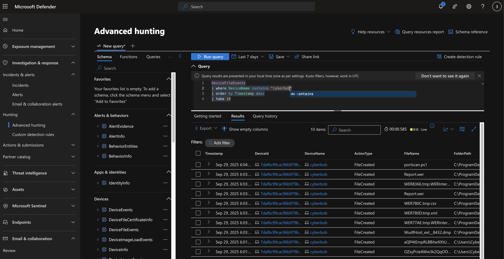
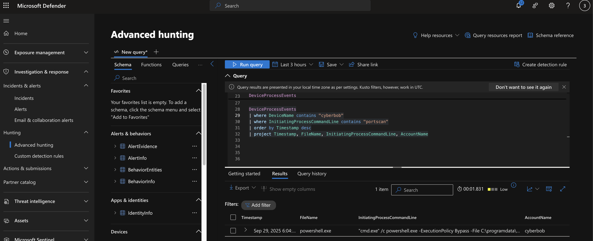

# 🧠 MDE Threat Hunting Lab – Sudden Network Slowdowns

## 🧭 Overview

This lab simulates a **port scanning investigation** using **Microsoft Defender for Endpoint (MDE)** telemetry to identify abnormal internal network behavior.  
The device `cyberbob` was observed generating multiple failed connection attempts across sequential ports, suggesting possible **PowerShell-based port scanning**.

The hunt leverages **DeviceNetworkEvents**, **DeviceProcessEvents**, and **DeviceFileEvents** tables to correlate suspicious network activity with process execution and file creation.

---

## 🎯 Objective

Identify abnormal internal network traffic patterns indicating **port scanning**, confirm through process and file telemetry, and validate through direct investigation on the suspect device.

---

## 🧱 Lab Setup

- **Device:** `cyberbob`
- **Network:** `10.0.0.0/16`
- **Scenario:** Internal port scan causing degraded network performance
- **Tool:** Microsoft Defender XDR (Advanced Hunting)
- **Script Used:** `portscan.ps1` (downloaded and executed via PowerShell)

### 🧰 PowerShell Script Deployed

```powershell
Invoke-WebRequest -Uri 'https://raw.githubusercontent.com/joshmadakor1/lognpacific-public/refs/heads/main/cyber-range/entropy-gorilla/portscan.ps1' -OutFile 'C:\programdata\portscan.ps1';
cmd /c powershell.exe -ExecutionPolicy Bypass -File C:\programdata\portscan.ps1
```

---

## 🧪 Threat Hunting Steps

### 1️⃣ Preparation
The **server team** noticed degraded performance in the internal network `10.0.0.0/16`.  
After ruling out external DDoS attacks, suspicion turned toward **internal scanning**.

**Hypothesis:**  
A host may be running a **PowerShell-based port scan** across internal IPs.

---

### 2️⃣ Data Collection

**Relevant Tables Queried:**
- `DeviceNetworkEvents`
- `DeviceProcessEvents`
- `DeviceFileEvents`

📸 *Screenshots:*  
  
  


---

### 3️⃣ Data Analysis

**Query 1: Count Failed Connections (High Volume Could Indicate Scanning)**

```kql
DeviceNetworkEvents
| where ActionType == "ConnectionFailed"
| summarize FailedConnectionsAttempts = count() by DeviceName, ActionType, LocalIP, RemoteIP
| order by FailedConnectionsAttempts desc
```
📸 *Screenshot:*  


---

**Query 2: Drill Down on IP in Question (`10.0.0.115`)**

```kql
let IPInQuestion = "10.0.0.115";
DeviceNetworkEvents
| where ActionType == "ConnectionFailed"
| where LocalIP == IPInQuestion
| order by Timestamp desc
```
📸 *Screenshot:*  


🧠 **Observation:** Sequential port failures suggest **port scanning**.

📸 *Screenshot:*  


---

### 4️⃣ Investigation

Pivot to `DeviceProcessEvents` around the time of suspicious activity.

```kql
let VMName = "windows-target-1";
let specificTime = datetime(2024-10-18T04:09:37.5180794Z);
DeviceProcessEvents
| where Timestamp between ((specificTime - 10m) .. (specificTime + 10m))
| where DeviceName == VMName
| order by Timestamp desc
| project Timestamp, FileName, InitiatingProcessCommandLine
```
📸 *Screenshots:*  


🧠 Found PowerShell command running portscan.ps1:
```
powershell.exe -ExecutionPolicy Bypass -File C:\programdata\portscan.ps1
```

Also confirmed **file creation** in `DeviceFileEvents`:
```
FileCreated | portscan.ps1 | C:\ProgramData
```

---

### 5️⃣ Response

- Logged into the **cyberbob** device  
- Verified PowerShell script presence and execution  
📸 *Screenshot:*  


- Ran antivirus scan with comment: “PowerShell Port Scan found on computer” 
📸 *Screenshot:*  
  


**Result:** No malware detected → Device was **reimaged/rebuilt** for assurance.

---

## 🧠 MITRE ATT&CK Mapping

| Observation | Technique | Description | Tactic |
|--------------|------------|--------------|---------|
| PowerShell execution with `-ExecutionPolicy Bypass` | **T1059.001** | Command and Scripting Interpreter: PowerShell | Execution |
| Sequential failed connections across multiple ports | **T1046** | Network Service Scanning | Discovery |
| Outbound connections on internal network | **T1071.001** | Web Protocols | Command & Control |
| Potential attempt to access remote services | **T1133** | External Remote Services | Lateral Movement |
| Script file creation | **T1105** | Ingress Tool Transfer | Command & Control |

---

## 🧾 Summary of Findings

| Item | Details |
|------|----------|
| **Root Cause** | PowerShell-based port scan (`portscan.ps1`) |
| **Device** | `cyberbob` |
| **Indicators** | High failed connection count, sequential port attempts |
| **Malware Found** | ❌ None |
| **Remediation** | ✅ Device isolated, scanned, and reimaged |
| **Next Steps** | Restrict PowerShell, enable network segmentation, monitor port scanning attempts |

---

## 🔧 Improvements

- 🚫 Restrict PowerShell script execution with **AppLocker**
- 🧱 Limit internal traffic using **firewall rules**
- 🔍 Create custom **MDE detection rule** for high failed connection count
- 🧠 Conduct regular internal **threat hunts** for lateral movement

---

## 📁 File Structure

```
/screenshots
│── DeviceNetworkEvents.png
│── DeviceProcessEvents.png
│── DeviceFileEvents.png
│── failed connections.png
│── PortScan.png
│── DeviceProcessEvents2.png
│── script running.png
│── cyberbob.png
│── antivirus1.png
│── specific IP Address.png
```

---

## 🧰 Tags
`#ThreatHunting` `#MicrosoftDefenderXDR` `#PowerShell` `#PortScan` `#MITREATTACK` `#BlueTeam`
